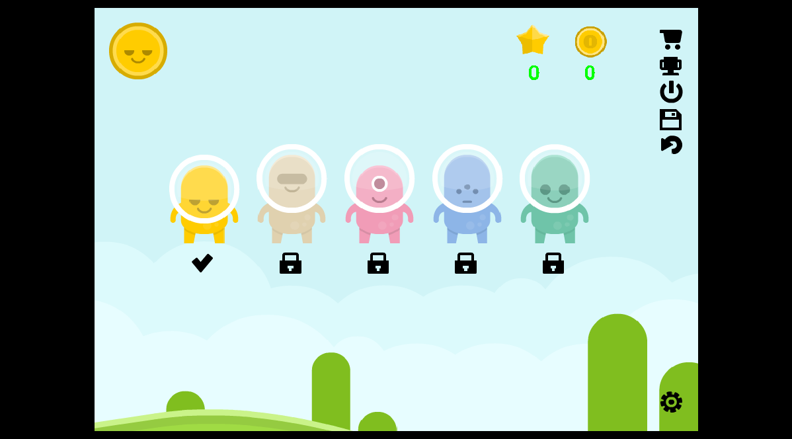
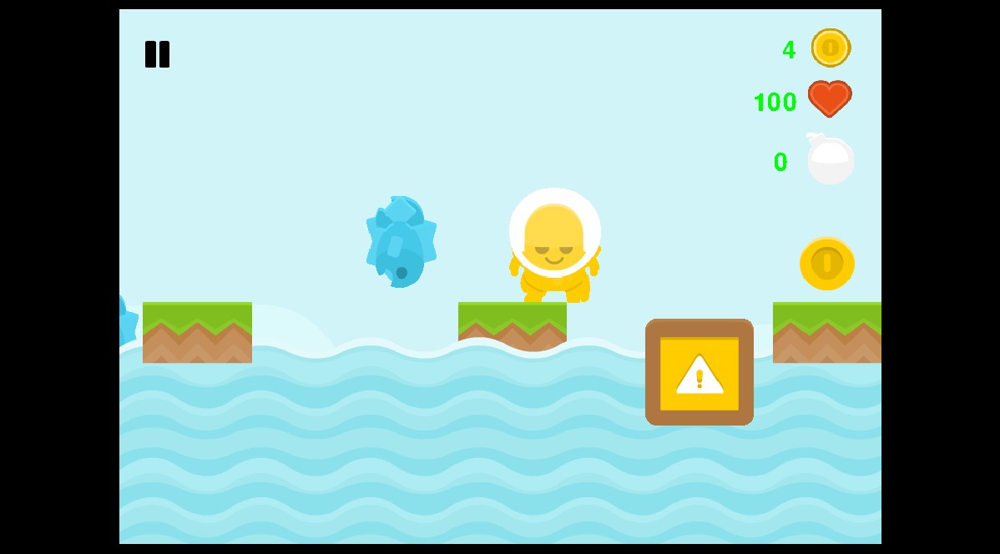

# gameOnPygame
This is simple platformer wtitten on Python + Pygame + PyAnim.

Game is done!

You will play for the different characters at different levels.

In game playing music : Dom Smart - Adventure.

If somebody can compile on Python with help cx-Freeze, do it!

