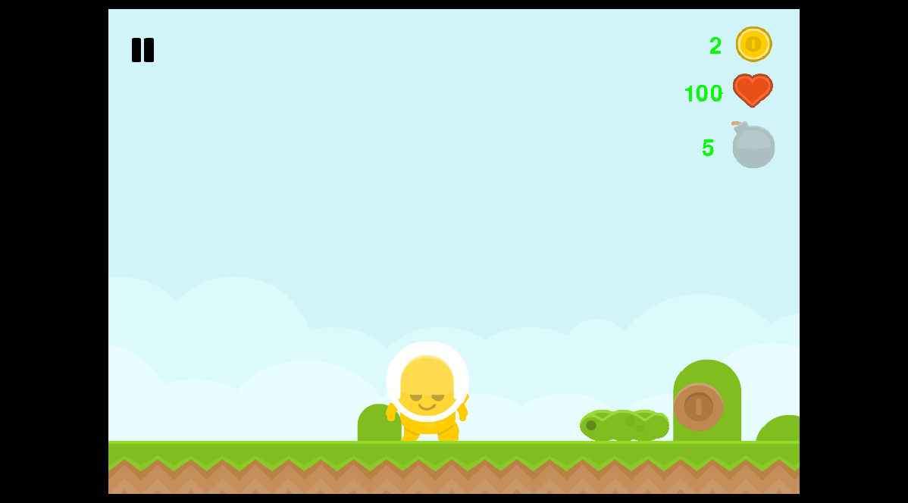
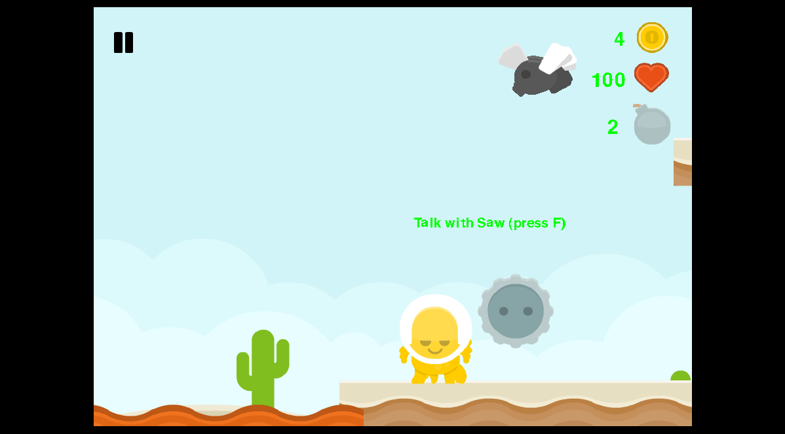

# gameOnPygame
This is simple platformer wtitten on Python + Pygame + PyAnim.

Game is done! (Almost)

You will play for the different characters at different levels.

In game play music : Dom Smart - Adventure.

The main game features:
- Five different characters;
- Five amazing levels;
- Music;
- Mobs and two bosses;
- Lot of explosions;
- Nice graphics;
- Multiplayer mode (in progress).

To play in the game, you need:
- Python interpreter 3.x (better 3.5.1);
- Pygame;
- PyAnim;
- Pyglet;

I know, that i can to use CxFreeze in order to gather exe-file. But i am not a masochist.

